# EKAHUA WIFI PLANNING

## 1. We used Air-magnet and ekahau to generate heatmap

* **AirMagnet**
  * License: Perpetual
  * Support: Subscription based. Needs to be renewed every year
  * Remarks: Currently we are not renewing the support for AirMagnet, which will not stop the operation of AirMagnet.
* **Ekahau**
  * License: Subscription Based
  * Support: Subscription based.

## 2. For Airmagnet we use promix dongle which contains License

## 3. For Ekahau sidekick will be compulsory

## Survey types

### Active survey and passive survey

**Active survey:** An active WiFi survey is when a surveying device is connected to the WiFi network and records signal measurements based on the performance of the connection. Active surveys are used to [troubleshoot WiFi networks](https://www.accessagility.com/wifi-design-guide). This type of survey also allows for various other metrics to be measured, such as ping round-trip-time (RTT), [throughput using iPerf/iPerf2/iPerf3](https://www.accessagility.com/blog/iperf-vs-iperf3), and Internet upload/downloads.

**Passive survey:** A passive WiFi survey is when the surveying device is not connected to any WiFi network and is only listening to the WiFi environment. Typically, the software used for these surveys is configured to scan specific channels and WiFi networks in order to measure signal strength and noise levels.

## EKAHAU

* **Automated Network Planning**: Automatically determine the optimal the number and location for your access points prior to physical deployment (Ekahau Site Survey Pro only)
* **Verification**: Perform active and passive indoor and GPS assisted outdoor site surveys to verify coverage and performance (GPS support in Ekahau Site Survey Pro only)
* **Analysis and Optimization**: Visualize network coverage, capacity, and performance, finetune them, and simulate changes in the network or environment
* **Troubleshooting**: Solve various Wi-Fi issues
* **Reporting**: Generate reports of Wi-Fi coverage and performance (Ekahau Site Survey Pro only)

## Passive Survey steps

### User Interface Overview

1. Access Point, Survey list, and Building view tabs
2. Toolbar
3. Visualizations Selections
4. Miniature Requirement view - Displays how the network perform against the requirements at a glance
5. Miniature Ping view - The digits on the top left are the last digits of the associated AP MAC address
6. Miniature Signal view
7. Spectrum analyzer quick launch
8. Planning and Survey tabs
9. Map view

### Planning and Survey Tabs

#### The Planning Tab

These tools are needed when working with a predictive design of a Wi-Fi network.

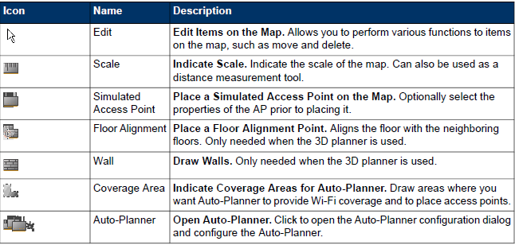

#### The Survey Tab

Survey - These tools are needed when performing site surveys or troubleshooting the network.

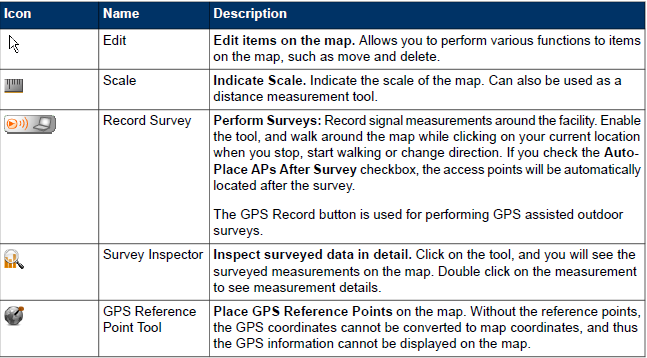

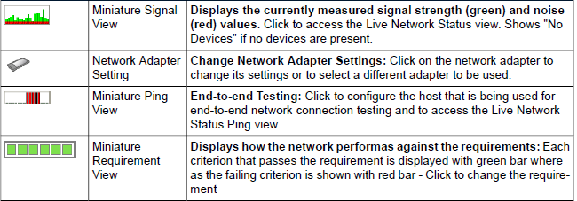

## Starting to work with Ekahau Site Survey

### 5.1 Starting Ekahau Site Survey

After the installation, ensure the following before starting Ekahau Site Survey:

* For traditional passive surveys: A supported Wi-Fi adapter is enabled and connected to your laptop (Visit http://www.ekahau.com/devices for the list of supported adapters)
* For Hybrid Surveys: A supported external Wi-Fi adapter is connected to your laptop and a supported integrated Wi-Fi adapter is enabled and associated with a Wi-Fi network using the Windows Wi-Fi Management tool.
* All other programs are closed
* You are logged in as the computer administrator, or have administrative privileges

To start Ekahau Site Survey, click Start > Programs > Ekahau > Ekahau Site Survey.

### 5.2 Setting the Map and Scale

The functionality of the program mostly relies on the floor plan(s) of the facility. You will need to insert at least one map and set its scale. For multi-floor buildings, add multiple maps, one for each floor.

To insert a map, click Site > Add Map or click the + sign next to the map selector. Alternatively, you can also import the floor maps directly from Cisco Prime NCS / WCS control system by selecting File > Import Maps from Cisco NCS/WCS.

The following image formats are supported for maps:

* BMP, WBMP
* JPG, JPEG
* PNG
* GIF
* SVG (SVG drawings)
* DWD, DXF (2D CAD drawings)

You also need to set the scale for each map. To set the scale, you need to know the distance between two points on the map. It is recommended to use a measuring tape to measure the distance between the points. Once measuring the real-world distance, set the scale in ESS:

* Select the scale tool
* Indicate the distance between the two points by clicking the first point, and holding down the left mouse button while moving the mouse pointer to the second point
* You will see a line between the two points, and a tooltip indicating the number of pixels. Click on the tooltip on the ft/m field and type in the distance between the two points in feet or meters

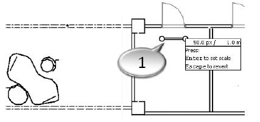

1. The door width is 1 meter / 3.3 feet which in this map image corresponds to 50 pixels.

**Tip**\
To set the length unit between feet and meters, go to File > Preferences.

## Designing a Wi-Fi Network

When designing a new Wi-Fi network, Ekahau Site Survey is able to create a network plan for you automatically. In ESS this feature is called Auto-Planner. The Auto-Planner saves you significant amounts of time by cutting down the manual work of placing access points and configuring their channels by hand.

Prior to deploying a Wi-Fi network with the Auto-Planner, you will need to indicate the coverage area(s) where you need Wi-Fi coverage. In addition, you will need to draw walls for the coverage area(s) so that ESS can calculate the optimal AP locations and configuration(s). In case you want to deploy a network plan for multi-floor building(s), please refer to chapter Designing Wi-Fi Networks for Multi-Floor Buildings on page 44 for more information on how to define multi-floor buildings.

Proper network planning will reduce costs in the long run, and will lead to better coverage and performance also. After creating the network plan, you will know:

* The optimal locations for your Wi-Fi access points
* Antennas and their alignment
* Optimal AP configurations, such as transmission power and channels
* The predicted coverage and performance of your network

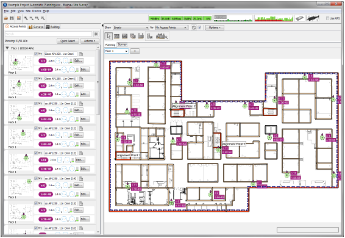

## Drawing and Editing Walls

To define the environment, you will have to draw walls. To do this, you will need to go to the Planning tab and select the Wall tool. First, you will need to select the wall material that most closely matches the wall you're going to draw. To draw the walls, simply keep left-clicking on the map. If you want to end the wall drawing, just right-click.

You can edit the walls that you have drawn by first selecting the Edit tool and left-clicking the wall you want to edit. You can edit multiple walls at the same time by holding down the Ctrl key while selecting the walls. To edit the wall(s), simply drag-and-drop the wall(s) to its new location. You can also change the wall material by right-clicking the wall and selecting Change Wall Type.

## Customizing the Wall Materials

If you want to customize the wall materials, you will need working knowledge of XML or HTML, and a plain text editor. The wall materials are specified in the wallTypes.xml file, located in the conf folder under the product installation folder. To edit the wall materials, open the wallTypes.xml file with a plain text editor, and add, remove or edit the wall materials. The tags are explained in the table below:

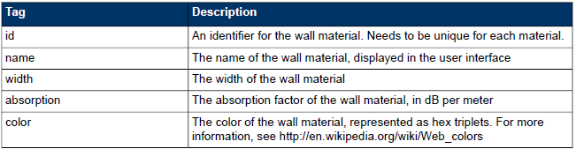

When inserting new wall materials, you will need to measure the signal strength both in front and behind the wall. Subtract the former from the later and you will get the signal loss in dB. Then measure the width of the wall, and calculate the absorption factor by diving the signal loss with the wall width in meters. Insert the new wall material into the conf file, save the file, and re-start ESS.

## Indicating Network Coverage Areas

In order to create the automated network plan, you will have to define the network coverage area where you would like to have Wi-Fi coverage. To do this, use the Coverage Area tool in the Planning tab to indicate the areas where you need Wi-Fi coverage. When using the tool, left-click to add points to the polygon, and right-click to end the polygon.

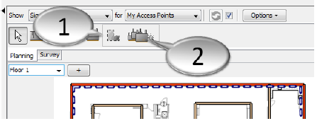

1. Click the Coverage Area button to define network coverage areas
2. Click the Auto-Planner button to open network requirements dialog and to create the network plan

**Drawing the network coverage area**

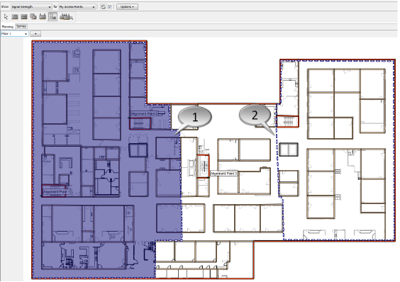

1. When you are drawing the network coverage area, the currently selected area will be displayed as lilac
2. After you have drawn the desirable network coverage area, it will be bordered with a dash line and the lilac colour will disappear.

## Configuring Auto-Planner

After you have defined the network coverage areas, click the Auto-Planner button to open the Auto-Planner dialog where you can select the Network Requirement, Access Point type as well as Channel Assignment.

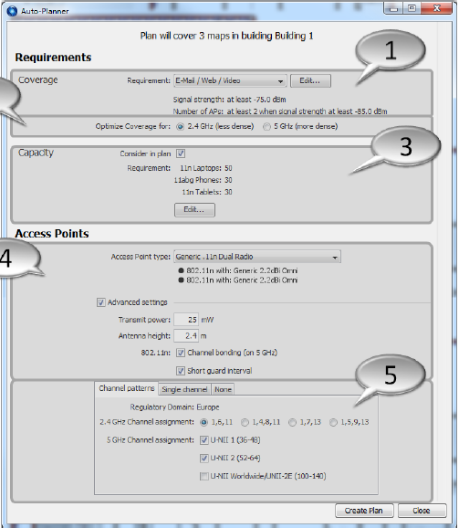



### Choose the network requirement type

You can select from one of the predefined requirements or define your own requirement. How to edit or define your own network requirements is explained in more details in chapter Defining Network Requirements on page 33.

Note that in the Auto-Planner only the Signal Strength and Number of APs requirements are taken in account.



### Select the Wi-Fi band

Select either 2.4 GHz or 5 GHz. If you want to optimize your network for 5 GHz Wi-Fi band, the network will be more dense than for 2.4 GHz.



### Define capacity requirements

(Optional) Define the capacity requirements for the network. Check the Consider in plan checkbox and a dialog for editing the capacity requirements will pop up. For more information on editing the capacity requirements, please refer to chapter.



### Select the access point type

Select the Access Point type you want to use in the network plan as well as Transmit power, Antenna height, and 802.11n characteristics.



### Define channel assignment

Define the Channel Assignment you want to use for your network plan. You can select a predefined channel assignment, just a single channel for example if you are using Meru Access Points, or none meaning that you will assign the channels after the network plan has been deployed.



After you have defined the requirements for you network plan, click the Create Plan button to deploy the network plan. The plan will be deployed for all floors in the building where you have defined the coverage areas. For separate floor maps that are not defined as a building, the network plan needs to be deployed separately for all floor maps.

If you are not satiesfied with the network plan, you can just re-run the Auto-Planner with a different Requirement, Access Point type, and/or Channel Assignment. Every time you re-run the Auto-Planner, it will clear the previous Access Point layout(s) and the AP configurations. Alternatively, you can manually change the location of the Access Point(s) with the Select tool or add more simulated access points. For more details on how to work with simulated access points.

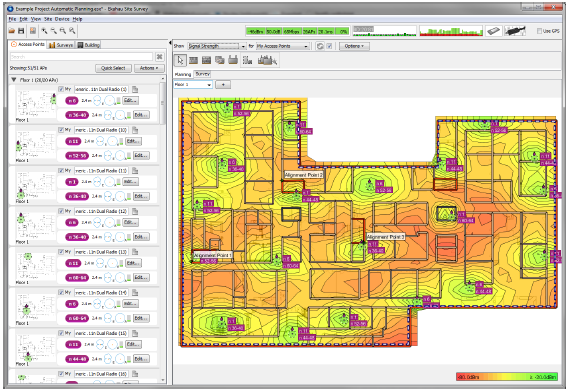

## Creating the Network Plan Manually Using Simulated Access Points



### Select the Simulated Access Point Tool

Select the Simulated Access Point Tool from the Planning Tab.



### Choose the access point

Choose the access point you want to simulate. You can simulate either a pre-defined AP or a customized AP with a particular antenna.



### Place the access point on the map

Place the access point on the map with a left-click. If Always Refresh Automatically visualization option is enabled, you should instantly see a visualization for the placed access point.



### Edit the AP properties

Click either the Edit button on the AP list or the technology/channel rectangle on the righthand side of the AP on the map to edit its properties. You can select the technology, channel and adjust the AP transmission power, AP height, and antenna downtilt.

The Elevation Pattern presentation of the antenna displays the beam towards the floor.

If you are simulating a 802.11n AP, you can also edit the Extension channel, # of Supported Spatial Streams, Greenfield, and Short Guard Interval properties.



### Repeat for more access points

Repeat steps 2-4 to place more access points.



### Editing simulated access point

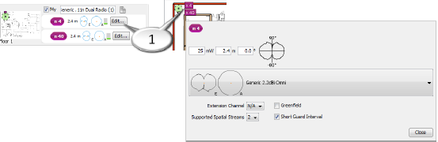

1. Click to edit a simulated access point

You can adjust a non-omnidirectional AP's orientation. Click and hold the small yellow triangle on top of the AP icon until you find the correct orientation.

## Analyzing the Wi-Fi Coverage and Performance

There are various visualizations that allow you to estimate network coverage and performance. The visualizations are displayed as "heat maps" on the map image.

The displayed visualization is selected using the two drop-down menus above the map window. The default visualization is Signal Strength for My Access Points. The first drop-down menu selects the visualization type, for example signal strength or data rate. The second drop-down selects what access points will be included in the visualization. If you want to visualize signal strength for one access point only, for example, you would select Show Signal Strength for Selected Access Points and just select the AP you want to see the signal strength for. The AP can be selected either from the map, or from the AP list.

When the visualization is displayed, roll over the map with the mouse to see the actual values on the map at a given point as a tooltip.

### Visualization view

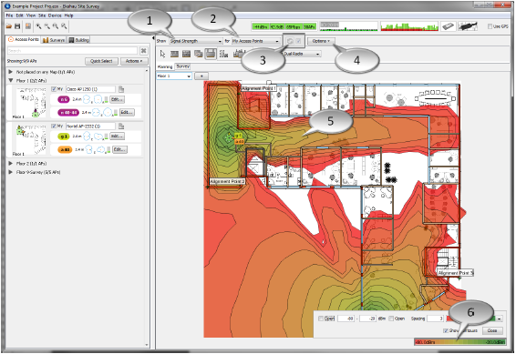

1. Visualization type
2. Visualized access points
3. Refresh visualization button - Uncheck the box to manually refresh the visualization
4. Visualization options
5. Visualization
6. Editing legend

For quick reference for visualization, see the tables below.

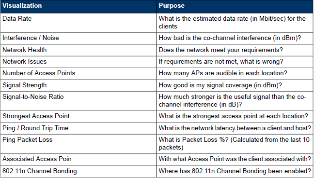

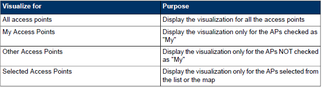

## Visualization Options

Visualization options are specific to the selected visualization, whereas some are generic and apply to all the visualizations.

The Visualization Options allow you to set parameters concerning the visualization accuracy, performance and overall appearance:

**Some visualization options are generic, some are visualization specific**

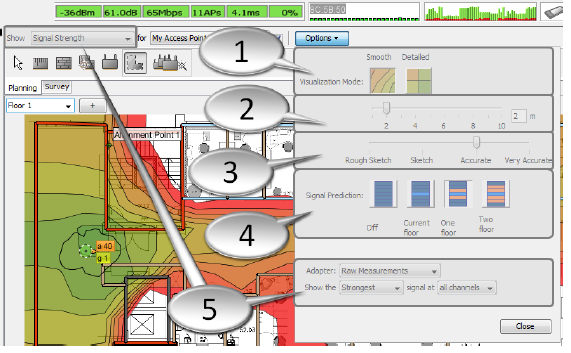

1. Visualization Mode - See the visualization in Smooth mode (polygons) or Detailed mode (rectangles)
2. Extrapolation - When Smooth Visualization Mode is selected, adjust the level of extrapolation in meters/feet
3. Speed vs. Accuracy - Allows the visualizations to be refreshed more quickly at the expense of the accuracy, or vise versa
4. Signal Prediction - Enable or disable all signal prediction. Can be used to predict signal propagation through other floors
5. Visualization specific options (In this case for Signal Strength visualization)

### Visualization Mode

The visualization heat maps are overlaid on the map using some amount of extrapolation, because every inch of the facility can not be surveyed. To adjust the amount of extrapolation, click the Options button next to the visualization selection.

There are two Visualization Modes:

* **Detailed:** The extrapolation is fixed. The Detailed Mode provides low extrapolation and accurate results. Does not allow adjusting the amount of extrapolation of data. Use Detailed mode when in-depth analysis is needed.
* **Smooth:** Adjustable amount of detail, as the user can set the extrapolation (in feet or meters).

**Visualization modes and extrapolation slider**

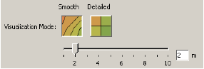

**Detailed and Smooth visualization modes**

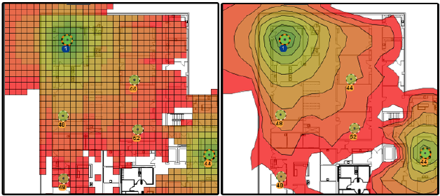

When designing large Projects with lots of walls and simulated access points, you may want to get visualizations updated quickly to find out the optimal number of access points, their locations and configurations as quickly as possible. At this point, the accuracy of the visualization may not be essential to find out the "ball park" locations and configurations of access points.

In situations like these, you can increase the visualization speed by adjusting the slider above the Signal Prediction options. The Rough Sketch will provide the fastest response with the least amount of detail, whereas the Very Accurate setting will provide most detail, sacrificing some of the response time.

### Signal Strength

The Signal Strength visualization displays the signal strength of the selected set of access points in dBm. By default, the signal strength of the strongest access points per location will be displayed.

Signal Strength has the following options accessible via Visualization Options:

* **Viewed Signal** allows you to disregard the signals from the strongest access points, visualizing the second or third strongest signals instead of the strongest one. This is useful for visualizing AP failover scenarios and redundancy.
* **Signals at Channel** limits the Signal Strength visualization to only show the signals at a selected channel. The Adapter selection allows you to visualize the signal strength as the selected adapter would "see" it. For example, the signal strength may be sufficient using a high-quality network adapter, but may not be sufficient using a wireless VoIP phone with different antenna characteristics. Ekahau Site Survey has characterized and field-tested various wireless adapters and VoIp phones to allow accurate simulation when deploying wireless networks for different adapters.

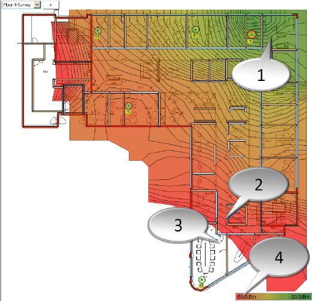

1. High signal strength
2. Low signal strength
3. Signal strength below -80dBm
4. Click to adjust signal strength visualization value range, colors, etc.
