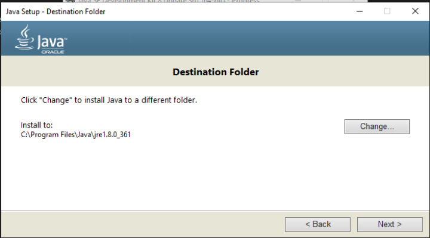

# WEB SECURITY (WEB INVENTORY)

## WEB

> 1. is Hacking a system from Trojan.
> 2. A Vulnerable Services.
> 3. A Vulnerable Web Application of the system.

> A Software service publicly hosted over WAN.
>
> Client browsers communicate via frontend language HTML, CSS, JavaScript.
>
> The frontend Language will communicate with the backend language like JAVA, REACT, PHP, SQL, and more.
>
> Then it goes so server operating system which are Linux & Windows based.
>
> The server will response to the request and from backend to frontend then the frontend response to client browser.

## &#x20;OWASP (Open Web Application Security Project)

> * It a non-profit organization which realize the TOP 10 most targeted web application Vulnerability Tree (Umerabla) over the world during the 4-year tenure.&#x20;
> * its spread awareness and contribute to the security community


* OWASP updates after 4 years as pre technology and security evolve, and Ranking are based on impact.
* Auditors also used OWASP as a prerequisetes.



* Github Cheatsheet
  * link: [https://cheatsheetseries.owasp.org/](https://cheatsheetseries.owasp.org/)

### OWASP TOP 10 2017

<table data-header-hidden><thead><tr><th width="89"></th><th width="495"></th><th></th></tr></thead><tbody><tr><td>Tops</td><td>Details</td><td>Roles</td></tr><tr><td>1.</td><td>Injection (The software code is injected and execute.)</td><td>Types</td></tr><tr><td>2.</td><td>Broken Authentication (Broken the confidentiality)</td><td>Types</td></tr><tr><td>3.</td><td>Sensitive data exposure (the valuable data exposed to internet)</td><td>Types</td></tr><tr><td>4.</td><td>XML External Entities (XML used in HTTP Header)</td><td>Vulnerabilities</td></tr><tr><td>5.</td><td>Broken Access Control (A User is authenticated and has unnecessary access.)</td><td>Types</td></tr><tr><td>6.</td><td>Security Misconfiguration (As a security engineer I have made a lot of mistakes like configure the policy without testing the policy.)</td><td>Types</td></tr><tr><td>7.</td><td>Cross Site Scripting  (Input malicious JavaScript code which results in comprised the system.)</td><td>Types</td></tr><tr><td>8.</td><td>Insecure Deserialization  (The data packet is tamper from the client side and the server didn't validate.)</td><td>Types.</td></tr><tr><td>9.</td><td>Using Component with known Vulnerabilities (All the common vulnerability comes under this.) </td><td>Types.</td></tr><tr><td>10.</td><td>Insufficient Logging and monitoring (The logs and monitoring resources are unavailable)</td><td>Types</td></tr></tbody></table>


**Ice Breaks Security, X-ray Breaks Security, Cats Ignore Useful Information.**


### OWASP Top 10 2021

<table data-header-hidden><thead><tr><th width="89"></th><th width="288"></th><th width="271"></th><th></th></tr></thead><tbody><tr><td><strong>Tops</strong></td><td><strong>Details</strong></td><td><strong>Roles &#x26; Referred by OWASP Top 2017</strong></td><td><strong>Current</strong></td></tr><tr><td>1.</td><td>Broken Access Control (A user is authenticated, and unnecessary privilege is given)</td><td>It's a type Referred by 2017 top 5</td><td></td></tr><tr><td>2.</td><td>Cryptographical Failover (Weak Encryption is used)</td><td>It's a type Referred by 2017 top 3</td><td></td></tr><tr><td>3.</td><td>Injection (Inject the software code and used the command an unintended way to comprise the system)</td><td>It's a type Referred by 2017 top 1</td><td></td></tr><tr><td>4.</td><td>Insecure Design (Cost cutting design which increase the risk factor)</td><td>It's a type Referred by 2017 top 5</td><td>New</td></tr><tr><td>5.</td><td>Security Misconfiguration (I have an this mistake a lot like create a policy and forget to test)</td><td>It's a type Referred by 2017 top 6</td><td></td></tr><tr><td>6.</td><td>Vulnerability &#x26; Outdated Components (all the Common vulnerability used in this)</td><td>It's a type Referred by 2017 top 9</td><td></td></tr><tr><td>7.</td><td>Identification &#x26; Authentication Failure (A user is authenticated and have unnecessary privileges)</td><td>It's a type Referred by Broken Access Control, 2017 top 5</td><td></td></tr><tr><td>8.</td><td>Software &#x26; Data Integrity Failure The data is tamper form the client side and the server didn't validate)</td><td>It's a type Referred by 2017 top 8</td><td>New</td></tr><tr><td>9.</td><td>Security Logging &#x26; Monitor Failure (less resources for logging and monitoring)</td><td>It's a type Referred by 2017 top 10</td><td></td></tr><tr><td>10.</td><td>Service-Side Request Forgery (the server will be the mediatory for the vulnerably server)</td><td>[The Server will be the middleman between External server through Attacker] it's a Vulnerability</td><td>New</td></tr></tbody></table>


Broken Cat Ignore Insecure Security Vulnerability Its Secure Seriously Secure


The organization has published this list since 2003 as a way to spread awareness of the web’s most targeted vulnerabilities. The Top 10 mainly applies to new or custom made software. Many of the world's largest organizations reference the OWASP Top 10 during application development to help ensure their programs address common security mistakes.&#x20;

&#x20;

Note: OWASP’s Top 10 is updated every few years as technologies evolve. Rankings are based on how often the vulnerabilities are discovered and the level of risk they present.&#x20;

&#x20;

Note: Auditors also use the OWASP Top 10 as one point of reference when checking for regulatory compliance.&#x20;

&#x20;Common vulnerabilities&#x20;

* Businesses often make critical security decisions based on the vulnerabilities listed in the OWASP Top 10. This resource influences how businesses design new software that will be on their network, unlike the CVE® list, which helps them identify improvements to existing programs. These are the most regularly listed vulnerabilities that appear in their rankings to know about:&#x20;

Broken access control&#x20;

* Access controls limit what users can do in a web application. For example, a blog might allow visitors to post comments on a recent article but restricts them from deleting the article entirely. Failures in these mechanisms can lead to unauthorized information disclosure, modification, or destruction. They can also give someone unauthorized access to other business applications.&#x20;

Cryptographic failures&#x20;

* Information is one of the most important assets businesses need to protect. Privacy laws such as General Data Protection Regulation (GDPR) require sensitive data to be protected by effective encryption methods. Vulnerabilities can occur when businesses fail to encrypt things like personally identifiable information (PII). For example, if a web application uses a weak hashing algorithm, like MD5, it’s more at risk of suffering a data breach.&#x20;

Injection&#x20;

* Injection occurs when malicious code is inserted into a vulnerable application. Although the app appears to work normally, it does things that it wasn’t intended to do. Injection attacks can give threat actors a backdoor into an organization’s information system. A common target is a website’s login form. When these forms are vulnerable to injection, attackers can insert malicious code that gives them access to modify or steal user credentials.  &#x20;

Insecure design&#x20;

* Applications should be designed in such a way that makes them resilient to attack. When they aren’t, they’re much more vulnerable to threats like injection attacks or malware infections. Insecure design refers to a wide range of missing or poorly implemented security controls that should have been programmed into an application when it was being developed.&#x20;

&#x20;Security misconfiguration&#x20;

* Misconfigurations occur when security settings aren’t properly set or maintained or used cost cutting outdated devices. Companies use a variety of different interconnected systems. Mistakes often happen when those systems aren’t properly set up or audited. A common example is when businesses deploy equipment, like a network server, using default settings. This can lead businesses to use settings that fail to address the organization's security objectives.&#x20;

&#x20;Vulnerable and outdated components&#x20;

* Vulnerable and outdated components is a category that mainly relates to application development. Instead of coding everything from scratch, most developers use open-source libraries to complete their projects faster and easier. This publicly available software is maintained by communities of programmers on a volunteer basis. Applications that use vulnerable components that have not been maintained are at greater risk of being exploited by threat actors.&#x20;

&#x20;Identification and authentication failures&#x20;

* Identification is the keyword in this vulnerability category. When applications fail to recognize who should have access and what they’re authorized to do, it can lead to serious problems. For example, a home Wi-Fi router normally uses a simple login form to keep unwanted guests off the network. If this defence fails, an attacker can invade the homeowner’s privacy.&#x20;

&#x20;Software and data integrity failures&#x20;

* Software and data integrity failures are instances when updates or patches are inadequately reviewed before implementation. Attackers might exploit these weaknesses to deliver malicious software. When that occurs, there can be serious downstream effects. Third parties are likely to become infected if a single system is compromised, an event known as a supply chain attack.&#x20;

A famous example of a supply chain attack is the SolarWinds cyber attack (2020) where hackers injected malicious code into software updates that the company unknowingly released to their customers.&#x20;

Security logging and monitoring failures&#x20;

* In security, it’s important to be able to log and trace back events. Having a record of events like user login attempts is critical to finding and fixing problems. Sufficient monitoring and incident response is equally important.&#x20;

&#x20;Server-side request forgery&#x20;

* Companies have public and private information stored on web servers. When you use a hyperlink or click a button on a website, a request is sent to a server that should validate who you are, fetch the appropriate data, and then return it to you.&#x20;
* Server-side request forgeries (SSRFs) are when attackers manipulate the normal operations of a server to read or update other resources on that server. These are possible when an application on the server is vulnerable. Malicious code can be carried by the vulnerable app to the host server that will fetch unauthorized data.&#x20;

&#x20;

#### The Mitre co-operation organization &#x20;

* Handles THE CVE & CWE&#x20;

#### CVE Common Vulnerabilities exposure &#x20;

What is CVE &#x20;

* Example I used TP-Link router for home internet and so do the many people and what if an attacker found out the vulnerability in TP-link router. I can be the target of that attacker. So, whenever the device is used in multiply location then if vulnerability found it comes under CVE. And if reported that CVE it gets CVE-ID with the credit of reporter and vuln details with patches details.&#x20;

#### CWE Common Weakness exposure &#x20;

* It's a category which Details about vulnerabilities & Patches where it's blinded with the CVE and CVSS&#x20;

#### CVSS&#x20;

* CVSS is a vector which gives the number how critical the vulnerabilities are.&#x20;

&#x20;

#### The BurpSuite &#x20;

What & Why BurpSuite&#x20;

* BurpSuits is a web application security testing framework by PortSwigger.&#x20;
* The client and Server packet level communication have a middle man burp suits.&#x20;
* It give the advantage to customized changes of communication between the server and client browser. &#x20;
* When open burp chose your project or tempory project  &#x20;
* Choose burp default or load configuration file from hackerone or bug bounty.  &#x20;
* Hackerone profile --> there is a tab scope --> download Burp suits project configuration File. &#x20;
* Burp professional has a burp browser in Setting >> Tools >> Burp Browser. &#x20;

* &#x20;

&#x20;

Global commands&#x20;

&#x20;

| Command       | Action                             |
| ------------- | ---------------------------------- |
| Ctrl+R        | Send to Repeater                   |
| Ctrl+I        | Send to Intruder                   |
| Ctrl+T        | Toggle Proxy interception          |
| Ctrl+F        | Forward intercepted Proxy message  |
| Ctrl+Shift+T  | Switch to Target                   |
| Ctrl+Shift+P  | Switch to Proxy                    |
| Ctrl+Shift+R  | Switch to Repeater                 |
| Ctrl+Shift+S  | Switch to Scanner                  |
| Ctrl+Shift+I  | Switch to Intruder                 |
| Ctrl+Shift+O  | Switch to Suite options            |
| Ctrl+Shift+A  | Switch to Alerts tab               |
| Ctrl+Equals   | Go to next tab                     |
| Ctrl+Minus    | Go to previous tab                 |

&#x20;

&#x20;

Editor Commands&#x20;

&#x20;

| Command           | Action                                       |
| ----------------- | -------------------------------------------- |
| Ctrl+S            | Search                                       |
| Ctrl+Period       | Go to next search match                      |
| Ctrl+Comma        | Go to previous search match                  |
| Ctrl+U            | URL-encode current selection                 |
| Ctrl+Shift+U      | URL-decode current selection                 |
| Ctrl+H            | HTML-encode current selection                |
| Ctrl+Shift+H      | HTML-decode current selection                |
| Ctrl+B            | Base64-encode current selection              |
| Ctrl+Shift+B      | Base64-decode current selection              |
| Ctrl+Delete       | Delete word                                  |
| Ctrl+Backspace    | Backspace word                               |
| Ctrl+D            | Delete line                                  |
| Ctrl+Right        | Go to next word                              |
| Ctrl+Shift+Right  | Go to next word (extend selection)           |
| Ctrl+Left         | Go to previous word                          |
| Ctrl+Shift+Left   | Go to previous word (extend selection)       |
| Ctrl+Down         | Go to next paragraph                         |
| Ctrl+Shift+Down   | Go to next paragraph (extend selection)      |
| Ctrl+Up           | Go to previous paragraph                     |
| Ctrl+Shift+Up     | Go to previous paragraph (extend selection)  |
| Ctrl+Home         | Go to start of document                      |
| Ctrl+Shift+Home   | Go to start of document (extend selection)   |
| Ctrl+End          | Go to end of document                        |
| Ctrl+Shift+End    | Go to end of document (extend selection)     |

&#x20;

Installation of BurpSuit&#x20;

&#x20;

| Prerequisite                                                                                                                                                                                                                                                                                                                                                            |
| ----------------------------------------------------------------------------------------------------------------------------------------------------------------------------------------------------------------------------------------------------------------------------------------------------------------------------------------------------------------------- |
| Java 8u downloads                                                                                                                                                                                                                                                                                                                                                       |
| 
<a href="https://www.oracle.com/java/technologies/javase/javase8u211-later-archive-downloads.html">https://www.oracle.com/java/technologies/javase/javase8u211-later-archive-downloads.html</a> 

Find : <a href="https://www.oracle.com/java/technologies/javase/javase8u211-later-archive-downloads.html#license-lightbox">jdk-8u361-windows-x64.exe</a> 
 |
|                                                                                                                                                                                                                                                                                                                                                                         |

<figure><figcaption></figcaption></figure>

&#x20;

| GitHub:                                                                                                                                                                                 |
| --------------------------------------------------------------------------------------------------------------------------------------------------------------------------------------- |
| 
<a href="https://github.com/raystyle/BurpSuite_Pro_v1.7.32">https://github.com/raystyle/BurpSuite_Pro_v1.7.32</a> 
<ul><li>Download as a zip </li><li>Extract the file </li></ul> |
| Open this: burp-loader-keygen-jas502n                                                                                                                                                   |
| If not work, then match the PATH using edit windows environment                                                                                                                         |

* Run \[if proment not come then restart the pc]&#x20;
* Do the manual option&#x20;
* The prompt will give the activation request &#x20;
* Then the activate response will come all&#x20;

&#x20;

| Syntax & Steps  |
| --------------- |
| Step1:          |
|                 |

<figure><figcaption></figcaption></figure>

&#x20;

* Next &#x20;
* Click on manual activations &#x20;

&#x20;

| Step 2   |
| -------- |
|          |

<figure><figcaption></figcaption></figure>

&#x20;

| Step 3                       |
| ---------------------------- |
|                              |
| Next & Finisih the Process.  |

<figure><figcaption></figcaption></figure>

&#x20;

| Run It On Browser                                                                                                                                    |
| ---------------------------------------------------------------------------------------------------------------------------------------------------- |
| <ul><li>Need to make a connection burp suite with browser </li><li>There is an extension which made this easy to connect with brute suite </li></ul> |
|                                                                                                                                                      |
| Download and add this extension.                                                                                                                     |
|                                                                                                                                                      |
|                                                                                                                                                      |

<figure><figcaption></figcaption></figure>

<figure><figcaption></figcaption></figure>

<figure><figcaption></figcaption></figure>

&#x20;

| Browser configuration of Certificate Authority  |
| ----------------------------------------------- |
| Manually --> setting – find –xy --->            |
|                                                 |
| In BurpSuits                                    |
|                                                 |
|                                                 |
|                                                 |

<figure><figcaption></figcaption></figure>

<figure><figcaption></figcaption></figure>

<figure><figcaption></figcaption></figure>

<figure><figcaption></figcaption></figure>

&#x20;

&#x20;&#x20;

&#x20;&#x20;

| To do that navigate to: http://burp/           |
| ---------------------------------------------- |
| .png>)  |
| Download this Certificate                      |

&#x20;

| Import the burp certificate into Browser       |
| ---------------------------------------------- |
| .png>)  |

&#x20;

| Trust this Certificate                         |
| ---------------------------------------------- |
| .png>)  |

&#x20;

&#x20;

&#x20;

| Verify the Certificate is been Uploaded successfully and being used.  |
| --------------------------------------------------------------------- |
| .png>)                         |

&#x20;

| In Firefox/Browser Extension setting turn on the foxy proxy  |
| ------------------------------------------------------------ |
| .png>)                |

Proxy The intermediator/interceptor&#x20;

What is Interceptor&#x20;

* The interceptor : the policeman which stop/freeze and unfreeze the requests , the packet level communication form browser to Server.&#x20;

<figure><figcaption></figcaption></figure>

| 
http history ==> which website is requested directly or indirectly all the logs in there in this tab. 

 
 |
| --------------------------------------------------------------------------------------------------------------------- |
| .png>)                                                                         |

* Target Tab&#x20;
* Its shows all the targets websites.&#x20;
* There is a scope feature which logs only the particular website. The request still goes with burp but it only logs the scope target.&#x20;

&#x20;

* Web Socket &#x20;
* Is used to send multiply data with multiply times, & its depends on Target it used WebSocket. &#x20;
* Example : WhatappWeb Used WEbsecet which auto checked every data.&#x20;

&#x20;&#x20;

| Scoping Your Target                            |
| ---------------------------------------------- |
| It will focus on the scope activities.         |
| .png>)  |

&#x20;

| Results                                        |
| ---------------------------------------------- |
| .png>)  |

&#x20;

&#x20;

&#x20;

| Filter used in Scope mode.                                                   |
| ---------------------------------------------------------------------------- |
| Site-map : It will going to show the tree map which has been crawl by burp.  |
| .png>)                                |

&#x20;Repeater The R\&D&#x20;

What is Repeator ?&#x20;

* Repeater tab helps to modify the request and get the response form the server & repeat the process.&#x20;
* Right click send it to repeater or Ctrl + R,&#x20;

<figure><figcaption></figcaption></figure>

&#x20;

&#x20;

| Change the HTTP Methods From GET to POST                                                                                                                                                                                                                                                                                                                                                                                                                                                    |
| ------------------------------------------------------------------------------------------------------------------------------------------------------------------------------------------------------------------------------------------------------------------------------------------------------------------------------------------------------------------------------------------------------------------------------------------------------------------------------------------- |
| .png>)                                                                                                                                                                                                                                                                                                                                                                                                                                               |
| 
PitchFolk 

 

What is PitchFolk ? 

 
<ul><li>Its kind of like dictionary attack where username &#x26; Passwords columns is in list. </li></ul>
 

 

 

Battling RAM 

 

What is Battling RAM ?  

 
<ul><li>It a single List payload but its uses the injection 1 and injection 2 combine. </li></ul>
 
 |
| .png>)                                                                                                                                                                                                                                                                                                                                                                                                                                               |
| I can make changes in the signup page \[statically]                                                                                                                                                                                                                                                                                                                                                                                                                                         |

&#x20;

Intruder The Faceoff&#x20;

What Is intruder ? &#x20;

* It has a functionality of FUZZING wherever the injection point is, it will do the tasks repetitively&#x20;

<figure><figcaption></figcaption></figure>

&#x20;

&#x20;

Intruder Attack Types&#x20;

&#x20;

Sniper&#x20;

&#x20;

What & Why Sniper ?&#x20;

&#x20;

* Sniper As the name says its sniper the payload to the particular injection, & It’s a Single List payload.&#x20;

| Syntax  With Example                                                                                                                                                                                                                                       |
| ---------------------------------------------------------------------------------------------------------------------------------------------------------------------------------------------------------------------------------------------------------- |
| 
Single List Payloads 

1 ==> injection1 

2 ==> injection 2 

 

1 == user1  

2 == empty  

1 == user 1  

2 == pass1   

1 == user2  

2 ==empty  

1 == empty  

2 == pass2..  
           |
| .png>)                                                                                                                                                                                                              |
| .png>)                                                                                                                                                                                                              |
| In this particular case sniper will add the given words into both injection point                                                                                                                                                                          |
| Results                                                                                                                                                                                                                                                    |
| .png>)                                                                                                                                                                                                              |
| 
Note :- test:test is the correct credentials. 

 
<ul><li>It first use the list in the first injection point After that it uses the same list into the Second injection point.  </li><li>It can be use like this As a password spray </li></ul> |
| .png>)                                                                                                                                                                                                              |
| Or use to get the filetype attacks.                                                                                                                                                                                                                        |
| Payload Processing will add the common word into the payload option                                                                                                                                                                                        |
| .png>)                                                                                                                                                                                                              |

&#x20;

Grep-Match&#x20;

What is Grep-Match ?&#x20;

* Like the linux grep works it grep something and give the output.

<figure><figcaption></figcaption></figure>

* The error is there in the grep wordlist so as a results its shows checked.&#x20;

&#x20;

Clusterbomb&#x20;

What Is ClusterBomb ? &#x20;

* Its type of brute forcing, it will list the words where the two-injection point is defined one by one, first injection point it will list the username 1 then all injection two lists & repeat the process first injection second's word.&#x20;
* Its type of brute forcing, It will lists & attacks where the two injections point is defined,&#x20;
* First injection point it will list the username1 then second injection point it will try all lists/payload/words. After then the first injection point username2 and second injection point all list & Repeat this process.&#x20;

&#x20;

| Syntax with Example                                                                                                                                                    |
| ---------------------------------------------------------------------------------------------------------------------------------------------------------------------- |
| 
1 ==> Injection 1 

2 ==> Injection 2 

 

1 == user1 

2== pass1 

1== user1 

2 == pass2 

1 == user2 

2== pass1….. 
 |
|                                                                                                                                                                        |
|                                                                                                                                                                        |
|                                                                                                                                                                        |

<figure><figcaption></figcaption></figure>

<figure><figcaption></figcaption></figure>

<figure><figcaption></figcaption></figure>

&#x20;PitchFolk&#x20;

What is PitchFolk ?&#x20;

* Its kind of like dictionary attack where username & Passwords columns is in list.&#x20;

| Syntax With Example                                                                                                         |
| --------------------------------------------------------------------------------------------------------------------------- |
| 
1 ==> Injection 1 

2 ==> Injection 2 

 

1== user1 

2==pass1 

1==user2 

2==pass2 
 |

&#x20;

<figure><figcaption></figcaption></figure>

&#x20;

Battling RAM&#x20;

What is Battling RAM ? &#x20;

* It a single List payload but its uses the injection 1 and injection 2 combine.&#x20;

| Syntax With Example                                                                                                                                |
| -------------------------------------------------------------------------------------------------------------------------------------------------- |
| 
1 ==> injection 1 

2 ==> injection 2 

 

1 == user1 

2 == user1 

 

1 == user2 

2 == user2 

 
 |
|                                                                                                                                                    |

<figure><figcaption></figcaption></figure>

